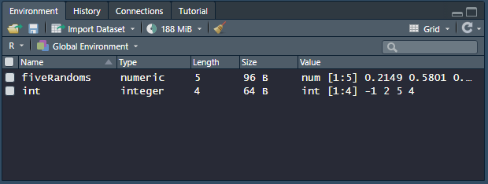
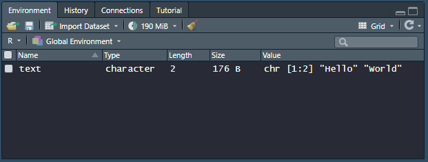
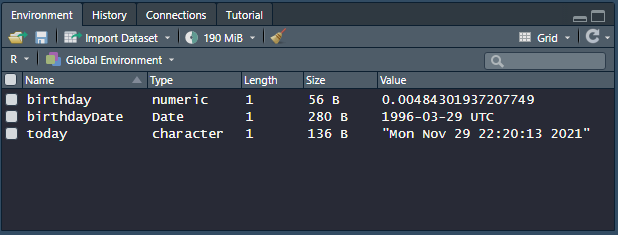
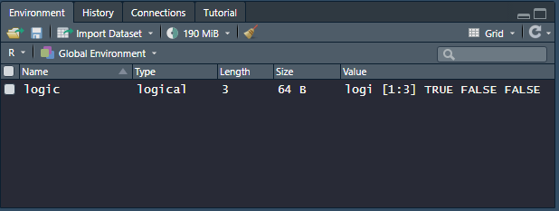
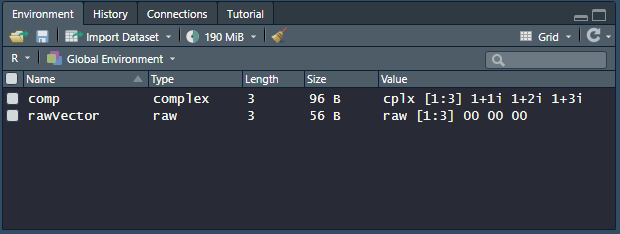
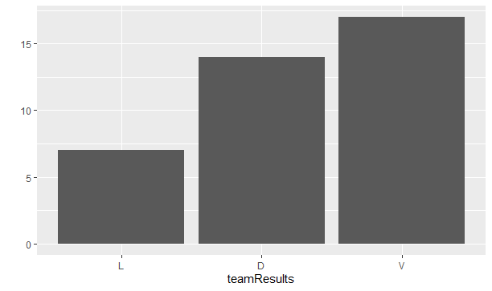

# Tipos de dados
Os tipos de dados (ou modos) definem como o R armazena nossos dados para que possamos utilizá-los futuramente. Vejamos a seguir os tipos de dados utilizados com maior frequência dentro da linguagem R.

## Numerics
### Doubles
O tipo _double_ é usado para armazenar números. Eles podem ser positivos ou negativos, grandes ou pequenos, e ter dígitos decimais ou não. De maneira geral, o R salva qualquer número que digitamos como um _double_. 
Por exemplo, vamos criar um vetor com 5 números usando a função ```runif```, que gera números aleatórios usando uma distribuição uniforme.
```R
fiveRandoms <- runif(n = 5)
fiveRandoms
[1] 0.21494491 0.58008975 0.93079987 0.06042004 0.33287358

typeof(fiveRandoms)
[1] "double"
```
>A função ```typeof``` indica qual é o tipo de dado de um objeto.

### Integers
O tipo _integer_ armazenam números inteiros, ou seja, números que podem ser escritos sem componentes decimais. Podemos especificar para o R que queremos armazenar os números como inteiros digitando o número seguido pela letra L em maiúsculo. Por exemplo:
```R
int <- c(-1L,2L,5L,4L)
int
[1] -1 2 5

typeof(int)
[1] "integer"
```
>O R não salvará um número como inteiro a não ser que seja incluído o L.

A diferença entre os números 5 e 5L é somente como o R os armazena na memória, na qual os inteiros são definidos com maior precisão.

Ao criarmos os dois objetos dos exemplos acima, podemos verificar o seguinte resultado no _Environment panel_:


>Para o R os dados numéricos podem tanto ser _doubles_ quanto _integers_.

Também podemos utilizar a função ```str``` para verificar o tipo de dados armazenados em um objeto:
```R
str(fiveRandoms)
 num [1:5] 0.2149 0.5801 0.9308 0.0604 0.3329

str(int)
 int [1:4] -1 2 5 4
```

## Characters
O tipo _character_ armazena pequenos fragmentos de texto. É possível criar um vetor de caracteres digitando um caractere ou uma _string_ de caracteres entre aspas:
```R
text <- c("Hello","World")
text
[1] "Hello" "World"

typeof(text)
[1] "character"

typeof("Hello")
[1] "character"
```
Os elementos de um vetor de caracteres são chamados de _strings_. Elas podem conter não somente letras, mas combinações de letras, números e símbolos.
Ao criarmos o vetor ```text``` do exemplo assim temos o seguinte resultado no _Environment panel_:


Ao analisarmos o vetor criado usando a função ```str``` o R nos mostra que ele é do tipo _character_ (_chr_) e que tem dois elementos.

## Date
O tipo _date_ é usado para armazenar datas. Vamos testar a criação de um objeto do tipo _data_ usando os códigos abaixo:
```R
today <- date()
birthday <- 29/03/1996

str(today)
 chr "Mon Nov 29 22:20:13 2021"

str(birthday)
 num 0.00484
```
Podemos perceber pelos resultados da função ```str``` que o R armazenou o resultado da função ```today``` (que retorna a data do sistema) como um vetor do tipo _character_. Enquanto isso o valor definido como ```birthday``` foi armazenado como um _double_, recebendo o resultado da operação matemática 29 dividido por 3, dividido por 1996. 
Isso indica que devemos ser cuidadosos quando tratarmos com dados do tipo _date_. Para armazenar datas usando o formato que tentamos no objeto ```birthday``` podemos utilizar a função ```as.Date```:
```R
birthdayDate <- as.Date("29/03/1996",format = "%d/%m/%Y")

str(birthdayDate)
 Date[1:1], format: "1996-03-29"
```
>O parâmetro ```format``` faz com que o R entenda exatamente o formato em que o valor de data foi inserido, para evitar interpretações ambíguas derivadas das diferentes formas de escrever datas usadas em países diferentes.

Podemos verificar o resultado dos comandos acima no _Environment panel_:


## Logicals
O tipo _logical_ armazena valores ```TRUE``` ou ```FALSE```, que são a forma de dados Booleanos do R. Ele é muito útil, especialmente para fazer comparações.
>Sempre que digitarmos ```TRUE``` ou ```FALSE``` em letras maiúsculas o R irá tratar como dados lógicos. Além disso, o R assume que ```T``` e ```F``` são abreviações para ```TRUE``` ou ```FALSE```
```R
logic <- c(TRUE,FALSE,FALSE)
logic
[1] "TRUE" "FALSE" "FALSE"

typeof(logic)
[1] "logical"

typeof(F)
[1] "logical"
```
Vejamos o resultado da criação do vetor ```logic``` seguindo os comandos acima:


## Complex and Raw
O tipo _complex_ armazena números complexos. Para criar um vetor complexo adicionamos uma componente imaginária para um número usando a letra 'i':
```R
comp <- c(1 + 1i, 1 + 2i, 1 + 3i)
comp
[1] 1+1i, 1+2i, 1+3i

typeof(comp)
[1] "complex"
```
Os vetores do tipo _raw_ armazenam bytes de dados. Podemos fazer um vetor do tipo _raw_ vazio usando a função ```raw```:
```R
rawVector <- raw(3)
rawVector
[1] 00 00 00

typeof(rawVector)
[1] "raw"
```
Seguem os resultados dos comandos acima no _Environment panel_:


---
## Mudando o tipo de dados
Uma característica conveniente do R é que quando não especificamos um tipo de dado ele tenta 'advinhar', definindo o dado com o tipo que ele achar que se encaixa melhor. No entanto, essa funcionalidade as vezes erra ou existem outras situações onde precisamos de um tipo específico de dado para executar uma determinada tarefa.
Para isso o R possui algumas funções de conversão:
* ```as.character```: Converte o dado para o tipo ```character```.
* ```as.numeric```: Converte o dado para o tipo ```numérico```.
* ```as.Date```: Converte o dado para o tipo ```date```.
* ```as.integer```: Converte o dado para o tipo ```integer```.
>A conversão entre alguns tipos de dados não é possível. Por exemplo, podemos fazer a conversão de um dado numérico para caractere, mas o inverso não é sempre possível. Se tentarmos converter caracteres que não são números para o tipo numérico o R irá nos alertar e substituir todos os elementos inválidos com o valor **NA**:
```R
mixed <- c("dog",10,"TRUE")
str(mixed)
 chr [1:3] "dog" "10" "TRUE"

mixedNum <- as.numeric(mixed)
 Warning message:
 NAs introduced by coercion 

mixedNum
[1] NA 10 NA
```
---
### Exemplo
O R possui um outro tipo de dados denominado _factor_. Eles parecem com caracteres, mas são armazenados como tal. Os _factors_ são muito importantes quando fazemos análises estatísticas em um _data set_. Vejamos um exemplo: Criaremos um vetor de caracteres para armazenar alguns nomes e depois alteraremos para o tipo _factor_ usando uma função:
```R
names <- c("Ben", "Alden", "Ben", "John", "Gabriel", "Max", "Matheus", "Evan")

str(names)
 chr [1:8] "Ben" "Alden" "Ben" "John" "Gabriel" "Max" "Matheus" "Evan"

names <- as.factor(names)
str(names)
 Factor w/ 7 levels "Alden","Ben",..: 2 1 2 5 4 7 6 3
```
Podemos observar que os _factors_ são caracteres que parecem ser armazenados como um código inteiro onde cada inteiro representa uma string. Por exemplo, o vetor ```names``` é do tipo _factor_ contendo 7 níveis únicos: "Ben", "Alden", "John", "Gabriel", "Max", "Matheus" e "Evan". Pela saída, o "Ben" é armazenado com o valor 2, "Alden" com o valor 1, "John" com o valor 5 e assim por diante. Portanto, cada nome foi associado a um inteiro que é armazenado internamente no R.
Podemos usar a função ```levels``` para verificar o nome de cada nível:
```R
levels(names)
[1] "Alden"   "Ben"     "Evan"    "Gabriel" "John"    "Matheus" "Max"
```
Ela retorna os nomes de acordo com a ordem do valor inteiro associado a eles, mas não retorna os números em si. Para verificar o mapeamento numérico podemos usar a função ```as.integer```:
```R
as.integer(names)
[1] 2 1 2 5 4 7 6 3
```
A vantagem é que o R está armazenando os _factors_ como números internamente, mas geralmente não há a necessidade de convertê-los para inteiros.
>Para obter maior controle sobre o mapeamento, use a função ```factor```.

No exemplo de código dessa seção criaremos um histograma para verificar o número de vitórias, empates e derrotas de um time de futebol dentro do campeonato brasileiro. 
Como o campeonato tem 38 rodadas, armazenaremos os resultados usando as pontuações associadas a vitórias (3 pontos), empates (1 ponto) e derrotas (0 pontos) em um vetor do tipo inteiro. Utilizaremos a função ```sample``` para gerar os resultados de maneira aleatória, combinando o parâmetro ```replace``` com uma distribuição de probabilidades de 20% para derrotas, 30% para empates e 50% para vitórias.
>Para mais detalhes, consultar o conteúdo da seção [0_functions](https://github.com/gasouna/R-basics/tree/master/0_functions "0_functions").

Em seguida utilizaremos a função ```factor``` para transformar esse vetor de pontuações (inteiro) em um _factor_, mapeando os valores de pontuação em 'V', 'D' e 'L' - representando vitórias, empates e derrotas, respectivamente.
Para o histograma importamos o pacote ```ggplot2``` e utilizamos a função ```qplot```.
>Para mais detalhes, consultar o conteúdo da seção [1_packages](https://github.com/gasouna/R-basics/tree/master/1_packages "1_packages").

Exemplo do resultado de uma execução:
