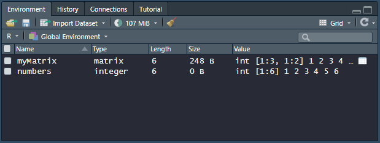
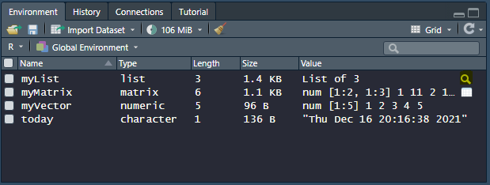
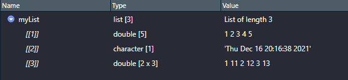

# Índice
* [Tipos de objetos (classes)](#tipos-de-objetos-(classes) 'Tipos de objetos (Classes)')
  * [Vetores](#vetores 'Vetores')
    * [Indexação de vetores](#indexação-de-vetores 'Indexação-de-vetores')
  * [Matrizes](#matrizes 'Matrizes')
    * [Indexação de matrizes](#indexação-de-matrizes 'Indexação Matrizes')
  * [Arrays](#arrays 'Arrays')
    * [Indexação de arrays](#indexação-de-arrays 'Indexação de arrays')
  * [Listas](#listas 'Listas')
    * [Indexação de listas](#indexação-de-listas 'Indexação de listas')
# Tipos de objetos (classes)
Ainda estamos considerando os objetos como 'caixas de sapatos' - uma coisa que pode armazenar coisas. Vimos que podemos armazenar diferentes tipos de elementos dentro das nossas caixas, mas indo mais a fundo as próprias caixas de sapato podem ter tipos diferentes já que temos caixas de sapato grandes, pequenas, de marcas diferentes, etc. O mesmo se aplica aos objetos no R. 
Existem algumas 'classes' de objetos que são mais utilizadas para armazenar diferentes tipos de objetos:
* Vetores
* Matrizes
* Arrays
* Listas
* Dataframes

Vejamos a tabela abaixo como um exemplo:

-|A|B|C
:-:|:-:|:-:|:-:
1|"dog"|0|5
2|"10"|10|23
3|"TRUE"|1|14

Olhando para as colunas A, B e C separadamente e considerando a notação usada pelo R, vemos que cada uma delas tem 3 elementos com o mesmo tipo. A coluna A tem três elementos armazenados como caracteres, enquanto as duas colunas seguintes tem três elementos numéricos cada. Essas três colunas representam **vetores** no R, ou seja, um conjunto unidimensional de elementos de um mesmo tipo (ou modo).

Por um outro lado, as células B1:C3 podem ser consideradas uma **matriz**. As matrizes no R podem armazenar somente elementos de um mesmo tipo (podemos enxergar como um vetor bidimensional). Se fizermos essa matriz ter mais dimensões, teremos um **array**. _Arrays_ podem ter múltiplas dimensões, mas assim como as matrizes só podem armazenar um único tipo de dado.

Podemos combinar todos esses objetos em um **lista**. Uma lista é uma coleção de objetos, somo uma loja de tênis - pode armazenar diferentes caixas de sapatos, inclusive outras lojas de tênis também. Muitas funções retornam os resultados em listas, onde cada parte mantém diferentes tipos de informação.

Por último, as células A1:B3 podem formar um **dataframe**, que é um tipo especial de lista composto por diferentes vetores, todos com o mesmo tamanho.
Cada um dos tipos de objetos tem diferentes propriedades e características que veremos a diante.

## Vetores
Os vetores são o tipo de objeto mais simples da linguagem R. Eles são conjuntos unidimensionais de objetos de um mesmo tipo.
```R
myVector <- c(1,2,3,4,5)
myVector
[1] 1 2 3 4 5
```

>Quando um objeto é um vetor a coluna _Type_ do _Environment panel_ mostra o tipo de dado que ele armazena (seu _modo_).


A função ```is.vector``` testa se o objeto é um vetor. Ela retorna ```TRUE``` se o objeto for um vetor e ```FALSE``` caso contrário.
```R
is.vector(myVector)
[1] TRUE
```
É possível criar vetores com um único elemento. Na verdade, o R salva valores únicos como um vetor de tamanho 1:
```R
five <- 5
five
[1] 5

is.vector(five)
[1] TRUE

length(five)
[1] 1
```
> A função ```length``` retorna o tamanho de um vetor.

### Indexação de vetores
Vamos criar um vetor de exemplo usando a função ```c```:
```R
box <- c("coin","keys","wallet","phone","AirPods","Alexa")
```
O vetor ```box``` armazena seis elementos do tipo caractere, representando objetos diferentes. Podemos recuperar informações específicas dessa 'caixa' usando o método de indexação do R para vetores, que são as chaves ( [ ] ). Por exemplo:
1. Para pegar o primeiro elemento do vetor usamos: ```box[1]```
2. Para pegar o terceiro elemento do vetor usamos: ```box[3]```
3. Para pegar os três primeiros elementos do vetor usamos: ```box[1:3]```
4. Para pegar os elementos 2, 4 e 6 do vetor usamos: ```box[c(2,4,6)]```
5. Para pegar todos os elementos, menos os elementos 1, 3 e 5 usamos: ```box[-c(1,3,5)]```
6. Para pegar todos os elementos, menos o elemento 5 usamos: ```box[-5]```
7. Para pegar os últimos 2 elementos, usamos: ```box[-(1:4)]```

Um índice é uma posição dentro de um vetor. Se um vetor tem 10 elementos, os índices irão de 1 até 10.
>Quando usamos a função ```c``` dentro dos índices podemos escolher qualquer combinação dos elementos e, inclusive, a ordem em que eles aparecerão.

Além da posição dos elementos dentro do vetor podemos usar **nomes**. Dessa forma, podemos extrair uma determinada informação do vetor baseando-se no nome dado para ela. Por exemplo, vamos criar um vetor denominado ```shoebox```, onde colocaremos um tênis da marca "Adidas", tamanho "40" e modelo "Superstar":
```R
shoebox <- c(brand = 'Adidas', size = '40', model = 'Superstar')

shoebox
     brand       size       model  
  "Adidas"       "40" "Superstar"
```
Podemos recuperar os nomes dos objetos usando a função ```names```:
```R
names(shoebox)
[1] "brand" "size" "model"
```
Agora o nosso objeto ```shoebox``` tem um **atributo** associado a ele.
>Nomes são apenas um de muitos atributos que um objeto pode ter. Mais informações sobre os atributos estão descritas na seção 03_attributes.

Quando os objetos são nomeados, podemos extrair informações usando os nomes ao invés das posições:
```R
# Extract the brand
shoebox['brand']
     brand
  "Adidas"

# Extract the size and model
shoebox[c('size','model')]
  size       model
  "40" "Superstar" 

# Change the size to 42
shoebox['size'] <- 42
  size
  "42"
```

## Matrizes
Uma matriz é um tipo especial de vetor em duas dimensões que armazena apenas um único tipo de dado (**dimensão** é um outro exemplo de atributo). Podemos criar matrizes usando a função ```matrix```. Os argumentos dessa função podem ser listados usando a função ```args```:
```R
# Get the arguments for the function called matrix
args(matrix)
 function (data = NA, nrow = 1, ncol = 1, byrow = FALSE, dimnames = NULL) 
 NULL

# Create a vector with numbers 1 to 6
numbers <- 1:6
numbers
 [1] 1 2 3 4 5 6

# Create a matrix
myMatrix <- matrix(data=numbers, nrow=3, ncol=2)
myMatrix
      [,1] [,2]
 [1,]    1    4
 [2,]    2    5
 [3,]    3    6
```
No exemplo acima, como não foi passado o argumento ```byrow``` o R usou o valor padrão (```FALSE```). Isso significa que a matriz será preenchida por coluna. Ou seja, é como se o R 'dobrasse' nosso vetor original de maneira a preencher todos os elementos da primeira coluna com e depois continuasse com os elementos restantes na segunda coluna.
>Se utilizássemos um número de elementos maior que o vetor original o R preencheria os elementos restantes com repetições dos originais.
```R
myMatrix2 <- <- matrix(data=numbers, nrow=2, ncol=4)
 Warning message:
 In matrix(data = numbers, nrow = 2, ncol = 4) :
   data length [6] is not a sub-multiple or multiple of the number of columns [4]

myMatrix2
      [,1] [,2] [,3] [,4]
 [1,]    1    3    5    1
 [2,]    2    4    6    2
```
Os símbolos ```[,1][,2][,3][,4]``` que vemos na primeira linha quando o R imprime nossa matriz são o cabeçalho, onde ```[,1]``` indica a coluna 1 e ```[,2]``` indica a coluna 2, e assim por diante. Nessa sintaxe, as linhas da matriz são representadas pelo primeiro inteiro, seguidas pela vírgula e o inteiro identificador da coluna.
>Se um identificador não está especificado, mas a vírgula está presente interpretamos como 'toda a linha' ou 'toda a coluna'. Então, ```[,1]``` representa toda a coluna 1.

Da mesma forma, os símbolos ```[1,]``` e ```[2,]``` a esquerda dos elementos são índices da nossa matriz, indicando qual é a linha que representam. A notação ```[1,]``` indica toda a coluna 1.

Olhando para o _Environment Panel_ podemos verificar nossa primeira matriz ```myMatrix```. É possível ver o **tipo** do nosso objeto (_matrix_). Esta é a sua _**classe**_. Também podemos dizer que é uma matriz olhando para a coluna _Value_, onde temos a notação ```[1:3, 1:2]```. Isso indica que nossa matriz tem 3 linhas e 2 colunas. O _int_ que precede essa notação indica que nossa matriz armazena dados do tipo inteiro (seu _**modo**_):



Podemos usar as funções ```nrow``` e ```ncol``` para obter informações sobre a estrutura da nossa matriz:
```R
# Get the number of rows
nrow(myMatrix)
 [1] 3

# Get the number of columns
ncol(myMatrix)
 [1] 2
```

A função ```dim``` retorna as duas informações de uma vez, com número de linhas primeiro, seguido do número de colunas:
```R
dim(myMatrix)
 [1] 3 2
```

Se aplicarmos a função ```length``` a uma matriz, teremos a quantidade de elementos que ela armazena:
```R
length(myMatrix)
[1] 6
```
Isso acontece porque as matrizes são, primordialmente, vetores (com atributo de dimensão). Como a função ```length``` é uma função aplicada a vetores, ela retorna a contagem de elementos da matriz.

### Indexação de matrizes
Assim como nos vetores, podemos usar os índices para extrair partes da informação armazenada nas matrizes:
```R
# Extract the element stored in row 3, column 2
myMatrix[3,2]
 [1] 6

# Extract the element stored in row 1, column 1
myMatrix[3,2]
 [1] 1

# Extract all rows but only column 2
myMatrix[,2]
 [1] 4 5 6

# Extract all elements
myMatrix[,]
      [,1] [,2]
 [1,]    1    4
 [2,]    2    5
 [3,]    3    6

# Extract all elements (vector like - elements 1 to 6 indexes)
myMatrix[1:6]
 [1] 1 2 3 4 5 6
```
Podemos atribuir nomes às colunas usando o atributo ```dimnames```, da seguinte forma:
```R
myMatrix <- matrix(data = c(1,2,3,11,12,13),
                   nrow = 2,
                   ncol = 3,
                   byrow = T,
                   dimnames = list(rows = c("row1","row2"),
                                   columns = c("C.1","C.2","C.3")))

myMatryx
       columns
 rows   C.1 C.2 C.3
   row1   1   2   3
   row2  11  12  13
```
Neste exemplo, usamos a função ```matrix``` para criar uma matriz de 2 linhas e três colunas preenchida por linhas (número 1, 2 e 3 preenchem a primeira linha e os números 11, 12 e 13 preenchem a segunda). O atributo ```dimnames``` foi usado para nomear as linhas e colunas. Para isso, passamos os nomes através de uma _lista_ (tipo de objeto que pode armazenar outros objetos dentro dele).

A partir disso, podemos usar os nomes das linhas e colunas para extrair elementos da matriz:
```R
# Extract the first row 
myMatrix["row1",]
 C.1 C.2 C.3 
   1   2   3 

# Extract the row 1 column 2
myMatrix["row1","C.2"]
 [1] 2
```
Podemos usar a função ```str``` para observar a estrutura criada para a matriz:
```R
str(myMatrix)
  num [1:2, 1:3] 1 11 2 12 3 13
  - attr(*, "dimnames")=List of 2
   ..$ rows   : chr [1:2] "row1" "row2"
   ..$ columns: chr [1:3] "C.1" "C.2" "C.3"
```
Pela saída vemos que o tipo de dados (_modo_) armazenados é numérico e os índices ```[1:2, 1:3]``` indicam as dimensões da matriz. Em seguida, o R nos mostra todos os elementos armazenados por ela.
Também é possível visualizar o atributo chamado _**dimnames**_ que atribuímos para a matriz, que por sua vez é uma lista com dois elementos (_List of 2_). Nas linhas logo abaixo identificamos que estes elementos são dois vetores (notação ```[1:2]``` e ```[1:3]```) que armazenam dados do tipo caractere, nomeados como _rows_ e _columns_, respectivamente.
>Cada parte da lista começa com o símbolo do cifrão ($).

## Arrays
Os _arrays_ são muito semelhantes às matrizes, com a diferença de suportarem mais de duas dimensões. Podemos construir um _array_ usando a função ```array```.
Como exemplo, vamos criar um _array_ contendo o número de funcionários de uma empresa, com idade entre 20 e 30, de cada sexo, nos últimos 3 anos. Para isso, iremos criar um _array_ contendo somente zeros e depois preenchê-lo com números aleatórios usando a função ```sample```: 
```R
employees <- array(data = 0,
                   dim = c(3,11,2),
                   dimnames = list(year = 1:3, age = 20:30, sex = c('male','female')))

employees
  ,,sex = male

      age
  year 20 21 22 23 24 25 26 27 28 29 30
     1  0  0  0  0  0  0  0  0  0  0  0
     2  0  0  0  0  0  0  0  0  0  0  0
     3  0  0  0  0  0  0  0  0  0  0  0

  ,,sex = female

      age
  year 20 21 22 23 24 25 26 27 28 29 30
     1  0  0  0  0  0  0  0  0  0  0  0
     2  0  0  0  0  0  0  0  0  0  0  0
     3  0  0  0  0  0  0  0  0  0  0  0
```
Ao observarmos nosso objeto no _Environment panel_ temos a seguinte situação:


Como é possível observar na imagem, temos 66 elementos numéricos (```num```) armazenados em três dimensões (```[1:3, 1:11, 1:2]```) dentro do nosso objeto que é do tipo ```array```.
>Assim como acontece com as matrizes, os _arrays_ são um tipo especial de vetores. Isso nos possibilita utilizar a função ```length``` para descobrir quantos elementos temos armazenados dentro dele.

Agora, com a função ```sample``` iremos criar um vetor com os 66 elementos que serão armazenados em nosso objeto. Só para exemplificar utilizaremos amostras de 50 a 100. Na substituição utilizaremos a notação ```employees[,,]```, que indica que queremos atribuir os valores do nosso vetor em todas as dimensões do _array_.
```R
individuals <- sample(x = c(50:100), size = 66, replace = T)

individuals
 [1]  60  81  81  71  97  68  65  68  86  71  69  77  75  71 100  77  75  69  69  87
 [21]  55  83  58  94  62  61  80  76  87  83  72  64 100 100  78  75  62  64  70  84
 [41]  60  67  84  90  99 100  52  86  79  91  53  92  70  75  84  77  58  95  96  82
 [61]  64  85  60  61  62  92

employees <- individuals

employees
  ,,sex = male

      age
  year 20 21 22 23  24 25 26 27 28 29  30
     1 60 71 65 71  75 77 69 83 62 76  72
     2 81 97 68 69  71 75 87 58 61 87  64
     3 81 68 86 77 100 69 55 94 80 83 100

  ,,sex = female
  
      age
  year  20 21 22 23  24 25 26 27 28 29 30
     1 100 62 84 84 100 79 92 84 95 64 61
     2  78 64 60 90  52 91 70 77 96 85 62
     3  75 70 67 99  86 53 75 58 82 60 92
```
Ao usarmos a função ```str``` temos o seguinte resultado:
```R
str(employees)
  num [1:3, 1:11, 1:2] 60 81 81 71 97 68 65 68 86  71 ...
  - attr(*, "dimnames")=List of 3
   ..$ year: chr [1:3] "1" "2" "3"
   ..$ age : chr [1:11] "20" "21" "22" "23" ...
   ..$ sex : chr [1:2] "male" "female"
```
Na primeira linha do resultado temos as dimensões do nosso _array_ e uma amostra dos elementos que estão armazenados. Temos a indicação que estes elementos são numéricos pela notação ```num``` e podemos ver que esse objeto possui o atributo ```dimnames``` formado por uma lista de 3 vetores: ```year```, ```age``` e ```sex```.

### Indexação de arrays
A sintaxe para extrair informações de um _array_ é bem semelhante a usada em vetores e matrizes, com a única diferença sendo a indicação de todas as dimensões:
```R
# Extract the male data for all years and all ages
employees[,,sex='male']
      age
  year 20 21 22 23  24 25 26 27 28 29  30
     1 60 71 65 71  75 77 69 83 62 76  72
     2 81 97 68 69  71 75 87 58 61 87  64
     3 81 68 86 77 100 69 55 94 80 83 100

# Extract the year 2 information
employees[year = '2',,]
      sex
  age  male female
    20   81     78
    21   97     64
    22   68     60
    23   69     90
    24   71     52
    25   75     91
    26   87     70
    27   58     77
    28   61     96
    29   87     85
    30   64     62

# Extract the information about the third index of age
## The thrid index is '21' years old
## Here the extraction is by position
employees[,2,]
      sex
  year male female
     1   71     62
     2   97     64
     3   68     70
```

>O R tem um outro tipo de objeto chamado _**table**_, que é um _array_ de valores inteiros. Objetos dessa classe podem ser criados através da função ```table```.

## Listas
Uma lista nada mais é do que uma coleção de diferentes objetos. Esses objetos, por sua vez, podem ser vetores, matrizes, arrays ou até mesmo outras listas.
Podemos criar listas usando a função ```list```. Por exemplo, vamos criar uma lista contendo os objetos ```myVector```, ```myMatrix``` e ```today``` dos exemplos anteriores:
```R
myList <- list(myVector,today,myMatrix)

myList
  [[1]]
  [1] 1 2 3 4 5
  
  [[2]]
  [1] "Thu Dec 16 20:16:38 2021"
  
  [[3]]
        columns
  rows   C.1 C.2 C.3
    row1   1   2   3
    row2  11  12  13
```
Ao executar o comando acima, podemos observar o objeto myList no _Environment Panel_ da seguinte forma:



Ao clicar no ícone de lupa destacado na imagem, o R nos abre a seguinte janela:



A notação ```[[]]``` (chaves duplas) indica que trata-se de uma lista. Como não numeramos as seções da nossa lista, cada um dos elementos é indicado pelo seu índice numérico. Ou seja, ```[[1]]``` representa o primeiro item, que é o vetor numérico. Os outros dois elementos são indicados pelos índices ```[[2]]``` e ```[[3]]```.

### Indexação de listas
Para extrair elementos da lista usamos a notação com as chaves duplas:
```R
myList[[1]]
  [1] 1 2 3 4 5

myList[[2]]
  [1] "Thu Dec 16 20:16:38 2021"
```
Essa notação irá extrair o elemento da lista, retornando-o para a sua classe original:
```R
class(myList[[2]])
  [1] "character"
```
>Se quisermos extrair o elemento como uma lista usamos chaves simples.

Para recuperar informações de dentro dos elementos da lista primeiro apontamos com as chaves duplas qual elemento queremos e depois usamos a notação do objeto em questão para recuperar a informação:
```R
# Extract the second number from myVector
myList[[1]][2]
  [1] 2

# Extract column C.1 from myMatrix
myList[[3]][,'C.1']
  row1 row2 
     1   11 
```
Podemos também nomear os elementos da lista, o que nos permite utlizar a notação _$_, que é equivalente as chaves duplas:
```R
myList <- list("myVector"=myVector,"today"=today,"myMatrix"=myMatrix)

str(myList)
  List of 3
   $ myVector: num [1:5] 1 2 3 4 5
   $ today   : chr "Thu Dec 16 20:16:38 2021"
   $ myMatrix: num [1:2, 1:3] 1 11 2 12 3 13
    ..- attr(*, "dimnames")=List of 2
    .. ..$ rows   : chr [1:2] "row1" "row2"
    .. ..$ columns: chr [1:3] "C.1" "C.2" "C.3"

myList$myVector
  [1] 1 2 3 4 5

myList$myMatrix[,'C.1']
  row1 row2 
     1   11 
```

## Data frames
Um _data frame_ é uma lista que contém vetores, sendo todos eles de um mesmo tamanho. A maior parte das bases de dados são armazenadas como _data frames_ no R.
Podemos usar a função ```data.frame``` para criar nossos _data frames_. Por exemplo, vamos combinar 3 vetores diferentes:
```R
fiveIntegers <- c(1L,2L,3L,4L,5L)
fiveBooleans <- c(TRUE,FALSE,TRUE,FALSE,TRUE)
fiveRandoms <- runif(n=5)

myDataFrame
    fiveIntegers fiveBooleans fiveRandoms
  1            1         TRUE  0.33293151
  2            2        FALSE  0.65182483
  3            3         TRUE  0.20610281
  4            4        FALSE  0.34774649
  5            5         TRUE  0.01188238

str(myDataFrame)
  'data.frame':	5 obs. of  3 variables:
   $ fiveIntegers: int  1 2 3 4 5
   $ fiveBooleans: logi  TRUE FALSE TRUE FALSE TRUE
   $ fiveRandoms : num  0.3329 0.6518 0.2061 0.3477 0.0119
```
Ao criarmos nosso _data frame_ podemos visuaizá-lo no _Environment panel_:


Podemos visualizar o conteúdo do _data frame_ clicando no ícone de tabela destacado na imagem anterior:


Podemos usar as funções ```rownames``` e ```colnames``` para extrair os nomes das linhas e colunas do nosso _data frame_, respectivamente:
```R
colnames(myDataFrame)
  [1] "fiveIntegers" "fiveBooleans" "fiveRandoms"

rownames(myDataFrame)
  [1] "1" "2" "3" "4" "5"
```
Para extrair informações do _data frame_ podemos utilizar a mesma notação das listas. Por exemplo:
```R
# Extract the third element from the fiveIntegers vector
myDataFrame$fiveIntegers[3]
  [1] 3

# Extract the fourth element from the fiveBoolens vector
myDataFrame[[2]][4]
  [1] FALSE
```

